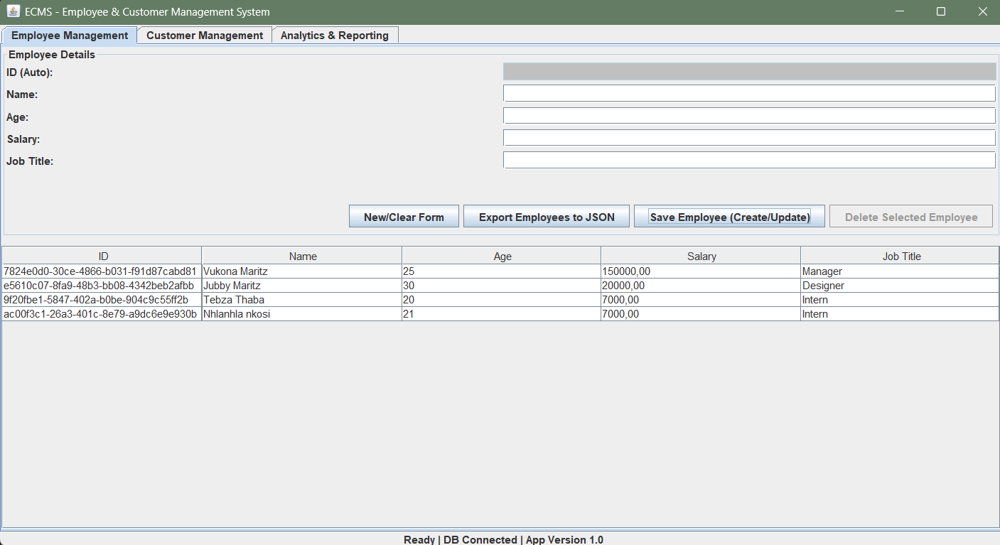
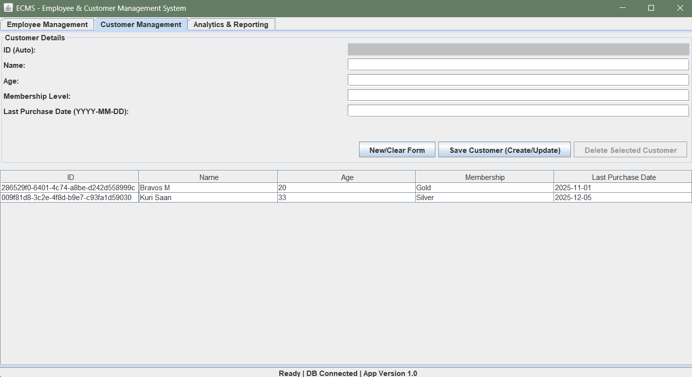

# Employee & Customer Management System (ECMS)

A Java-based desktop application for managing employees and customers with full CRUD functionality, analytics, and multiple persistence formats.

## 🚀 Features
- Register, view, update, and delete employees/customers
- SQLite database integration with smart schema loader
- Validation and exception handling
- Analytics: average age, average salary, membership breakdown
- Export/import data in JSON and text formats
- Java Swing GUI

## 🛠️ Tech Stack
- Java (Swing)
- SQLite
- Gson
- Maven

## 📂 Project Structure
- `src/ecms/model` → Entity classes (Person, Employee, Customer)
- `src/ecms/dao` → Database access (JdbcEntityDAO, Db)
- `src/ecms/util` → Utilities (JsonExporter, SchemaLoader)
- `src/ecms/view` → GUI (MainFrame, RegisterForm, EntityTable)
- `resources/schema.sql` → Database schema

## ▶️ How to Run

This project is built using standard Java and requires a Java Development Kit (JDK) 8 or higher.

### Option 1: Running from IDE (Recommended)

1.  **Clone the Repository:**
    ```bash
    git clone [Your Repository URL]
    ```
2.  **Open in IDE:** Open the project folder in your IDE (e.g., IntelliJ IDEA, Eclipse).
3.  **Resolve Dependencies:** Ensure your project is set up to automatically resolve the required SQLite and Gson libraries (often handled by a build tool like Maven or Gradle, or by manually adding the JARs to the `lib/` folder).
4.  **Run Main Class:** Locate the main application entry point at `src/gui/Main.java`.
5.  **Execute:** Right-click `Main.java` and select "Run".

### Option 2: Running from JAR (For Deployment)

1.  **Build the JAR:** Compile the project and package it into an executable JAR file (e.g., `ECMS_Project.jar`).
2.  **Execute:** Run the application from your command line:
    ```bash
    java -jar ECMS_Project.jar
    ```

## 🖼️ Application Screenshots

### Main Dashboard
*(...)*

### Employee Management Panel


### Customer Management Panel


### Analytics Reporting
*(....)*